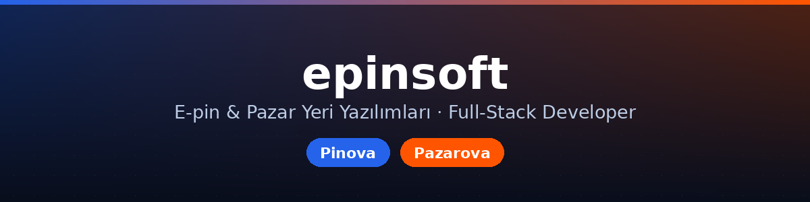

  

  Merhaba 👋 Ben <b>Oğuzhan</b> — full-stack web geliştiriciyim. 
  <b>Epin yazılım & epin scripti</b> · pazar yeri (marketplace) yazılımları · SaaS · Otomasyon geliştiriyorum.

  
  &nbsp;
  

  
  
  
  
  
  

---

## 🚀 Ürünlerim

<table>
<tr>
<td width="50%" align="center">
  
    
  <b>🔵 Pinova</b> — Epin satış scripti / epin yazılımı
   Tam otomatik teslimat · bakiye · bayilik · AI blog
    
  <a href="https://pinova.epinsoft.com.tr">▶ Canlı Demo</a> &nbsp;·&nbsp; <a href="https://github.com/epinsoft/pinova-vitrin">Vitrin</a>
</td>
<td width="50%" align="center">
  
    
  <b>🟠 Pazarova</b> — Çok-satıcılı pazar yeri yazılımı
   Emanet (escrow) · komisyon kademeleri · oyunlaştırma
    
  <a href="https://pazarova.epinsoft.com.tr">▶ Canlı Demo</a> &nbsp;·&nbsp; <a href="https://github.com/epinsoft/pazarova-vitrin">Vitrin</a>
</td>
</tr>
</table>

## 🛠️ Uzmanlık
- **Backend:** PHP (CodeIgniter / Laravel), MySQL/MariaDB, REST API, ödeme & webhook entegrasyonları
- **Frontend:** duyarlı (responsive) arayüz, saf JS, WordPress/Elementor
- **Ürün:** e-ticaret, **epin scripti / epin yazılımı**, çok-satıcılı **pazar yeri (marketplace) scriptleri**, SaaS panelleri, escrow & komisyon sistemleri geliştiriyorum
- **Otomasyon:** içerik/sosyal medya otomasyonu, scraping, cron iş akışları

## 📫 İletişim
Epin/pazar yeri yazılımı, iş birliği ve proje talepleri için:
- 🌐 **Web:** [epinsoft.com.tr](https://epinsoft.com.tr)
- ✉️ **E-posta:** pazarlama@epinsoft.com.tr
- 📞 **Telefon:** +90 850 255 18 01
